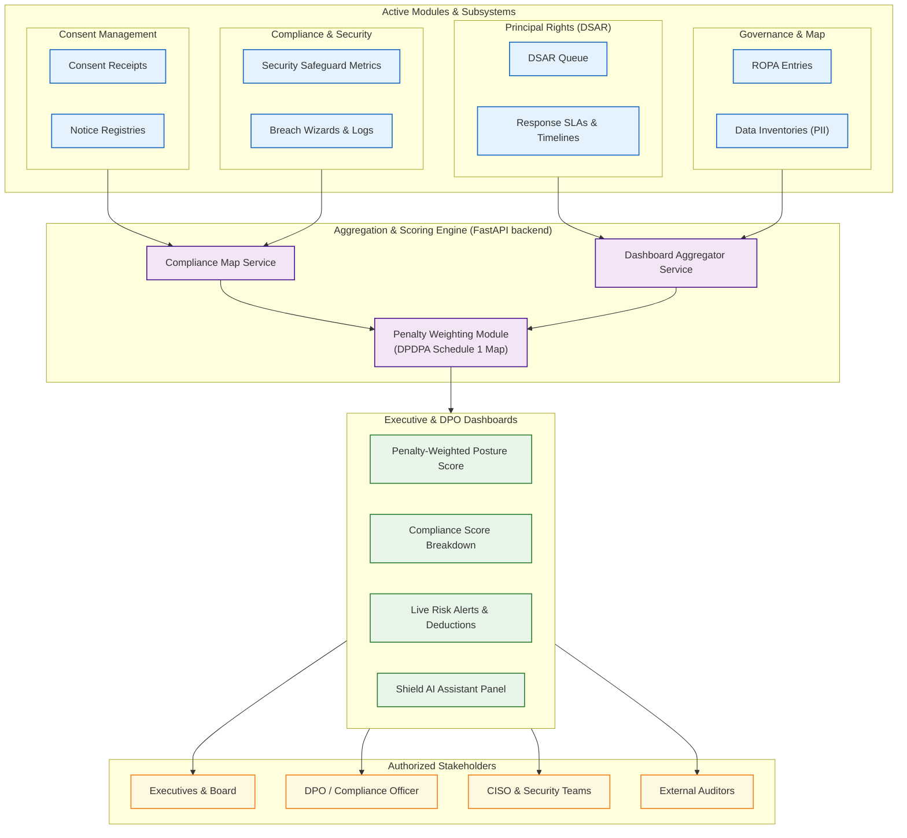
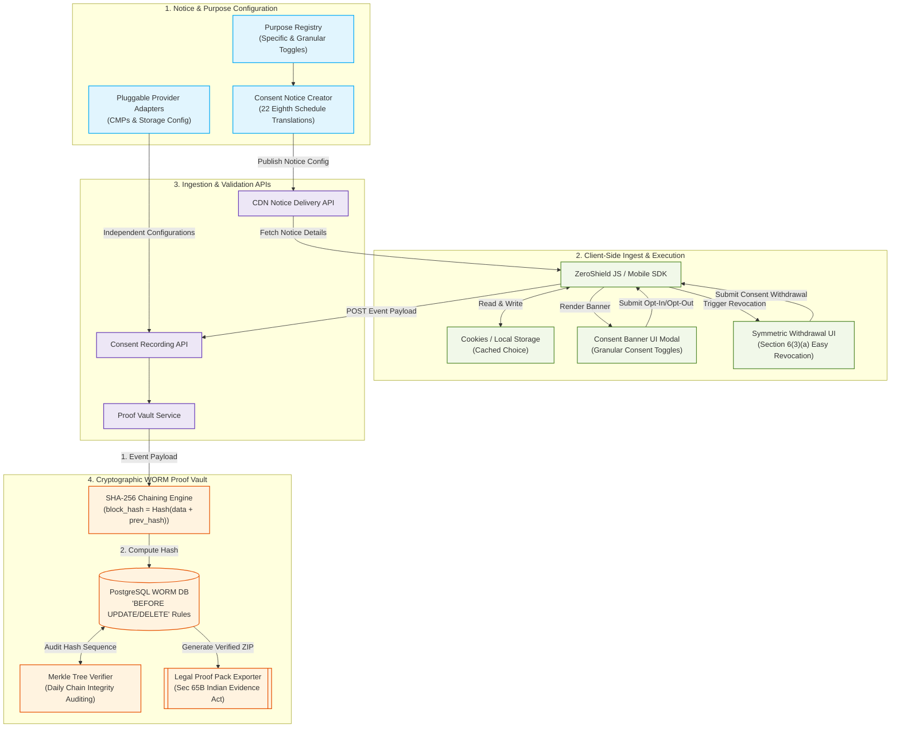
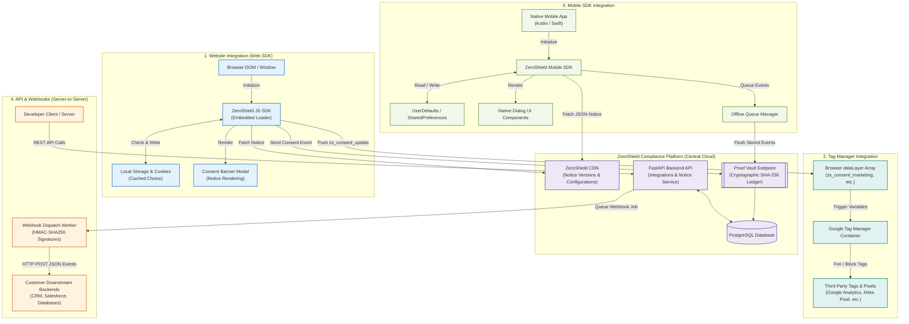
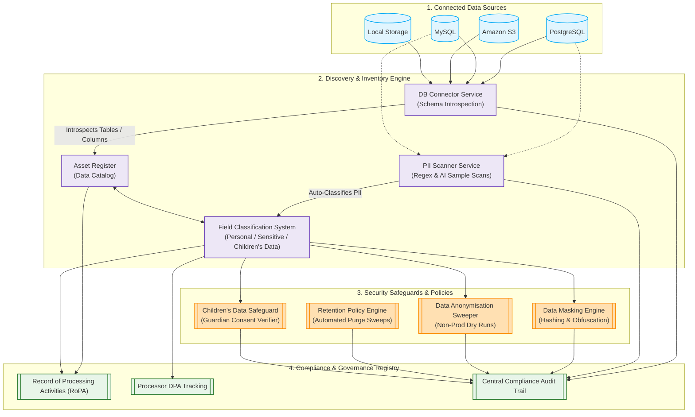
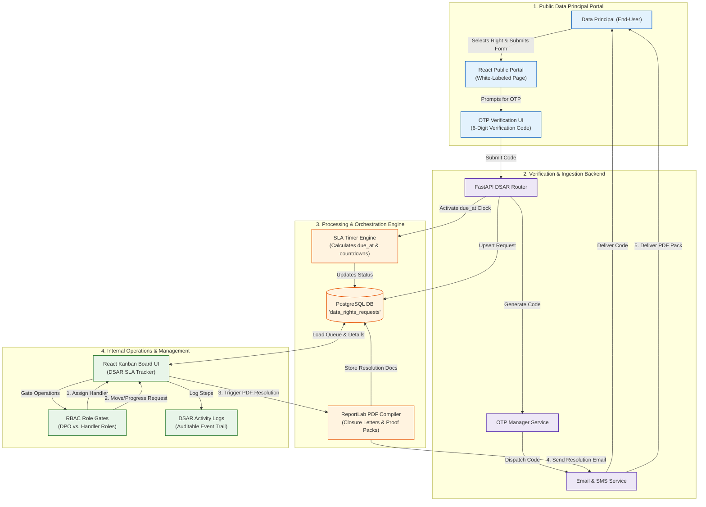
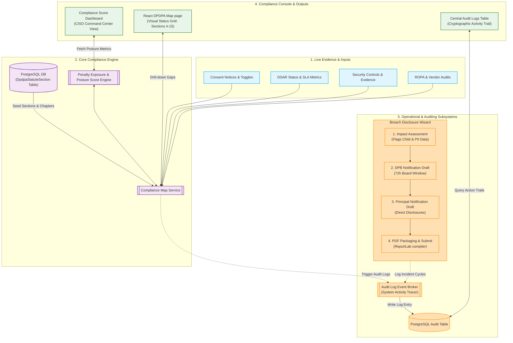
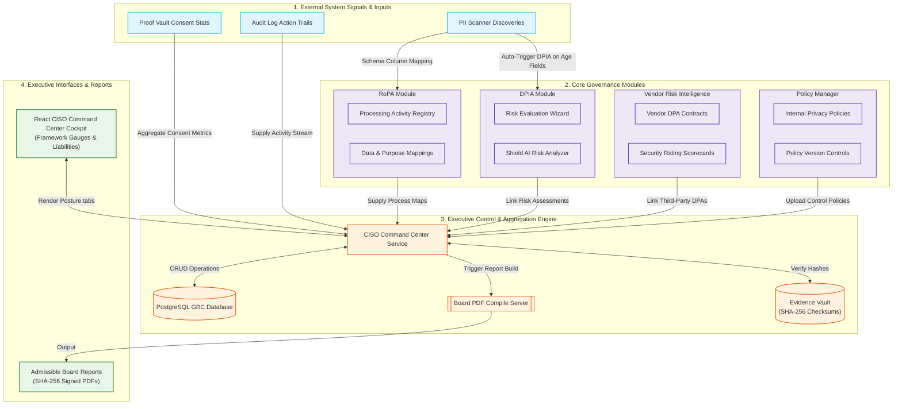

# 🛡️ _DPDPA Shield — Digital Personal Data Protection Compliance Platform_

### *Enterprise-Grade DPDPA Compliance Automation, powered by Cryptographic Proof & Generative AI*

 

   
    
   <em>DPDPA Shield, a part of <a href="https://zeroshield.ai">ZeroShield</a></em>

  
  
  
  
  
  
  
  
  

### 🚀 [Sign Up for DPDPA Shield](https://dpdplawshield.zeroshield.ai/)

---
## Table of Contents

- [Trial License & Security](#trial-license--security)
- [Paid Access](#paid-access)
- [About DPDPA Shield](#about-dpdpa-shield)
- [Core Mission](#core-mission)
- [The DPDPA Regulatory Challenge](#the-dpdpa-regulatory-challenge)
- [Key Capabilities](#key-capabilities)
- [Platform Architecture](#platform-architecture)
- [Target Users](#target-users)
- [Feature Overview](#feature-overview)
  - [Platform Guides & How to Use](#platform-guides--how-to-use)
  - [Shield AI](#shield-ai)
  - [1. Overview](#1-overview)
  - [2. Consent Management](#2-consent-management)
  - [3. Integrations](#3-integrations)
  - [4. Data Protection](#4-data-protection)
  - [5. Data Principal Rights](#5-data-principal-rights)
  - [6. Compliance](#6-compliance)
  - [7. Governance](#7-governance)
  - [8. Settings](#8-settings)
  - [9. Administration](#9-administration)
- [DPDPA Section Compliance Mapping](#dpdpa-section-compliance-mapping)
- [Example Workflows & User Benefits](#example-workflows--user-benefits)
- [Use Cases](#use-cases)
- [Case Studies](#case-studies)

- [Support](#support)
- [Get Involved](#get-involved)

---

## About DPDPLawShield

**DPDPLawShield** is an enterprise compliance automation platform within the **[ZeroShield](https://zeroshield.ai)** ecosystem, purpose-built to help Indian organisations achieve, demonstrate, and maintain compliance with the **Digital Personal Data Protection (DPDP) Act, 2023**.

From granular consent capture and cryptographic proof vaults to automated PII scanning, 72-hour breach disclosure, and Data Principal rights management, DPDPLawShield converts the statute's most complex obligations into automated, real-time software guardrails — eliminating manual audit cycles and protecting organisations from statutory penalty exposure of up to **₹250 Crores per breach event**.

---

## Core Mission

Transform the DPDP Act's complex regulatory requirements into a single, unified SaaS platform that automates consent lifecycle management, proves compliance through tamper-proof cryptographic evidence, detects personal data risks before they become breaches, and empowers Data Principals to exercise their statutory rights — all with zero modification to existing application code.

---

## The DPDPA Regulatory Challenge

The DPDP Act, 2023 introduces a fundamentally stricter standard than previous Indian privacy frameworks:

| Challenge | Details |
|-----------|---------|
| **Burden of Proof (Section 6(10))** | The *Data Fiduciary* (your organisation) must prove valid consent was obtained — not the regulator |
| **Strict Opt-In Mandate** | Silent, pre-ticked, or bundled consent is illegal. Consent must be specific, informed, unconditional, and given via a clear affirmative action |
| **Severe Penalty Exposure** | Personal data breach: **₹250 Cr** · Failure to notify: **₹150 Cr** · Children's data violation: **₹200 Cr** |
| **DPBI Oversight** | The Data Protection Board of India (DPBI) has direct adjudicatory powers with no cap on repeat violations |
| **Eighth Schedule Languages** | Consent notices must be accessible in all 22 officially recognised Indian languages |
| **72-Hour Breach Window** | Mandatory DPBI notification within 72 hours of discovering a personal data breach |

DPDPLawShield addresses every one of these challenges out of the box.

---

## Key Capabilities

- 🗺️ **Penalty-Weighted DPDPA Posture Scoring** — live compliance score weighted by each section's statutory fine
- 📝 **Granular Consent Management** — purpose registry, pluggable provider adapters, and symmetric withdrawal flows
- 🔐 **Cryptographic Proof Vault** — SHA-256 chained, WORM ledger generating Indian Evidence Act Section 65B-compliant legal proof packs
- 🍪 **Cookie & Tracker Manager** — headless Playwright crawler with real-time prior-consent enforcement
- 👶 **Children's Data Safeguard** — verifiable parental consent workflows and zero-tracking enforcement API
- 🔍 **Data Discovery & PII Scanner** — automated schema scanning across PostgreSQL, MySQL, Amazon S3, and local directories
- 🧮 **Data Anonymisation & Retention** — k-Anonymity, l-Diversity, Laplace Differential Privacy, and automated deletion with certificates
- 🎫 **Data Principal Rights Portal** — OTP-verified DSAR portal with Kanban SLA tracker and statutory countdown alarms
- 🌐 **Cross-Border Transfer Governance** — restricted-country verification, DPA contract builder, and SDF registry
- 🚨 **72-Hour Breach Disclosure Wizard** — guided stepper with pre-filled DPBI templates and tamper-proof evidence PDFs
- 🔑 **Role-Based Access Control** — strict RBAC matrix with append-only audit log event broker
- 🤖 **Shield AI** — AI-powered compliance assistant embedded across the platform

---

## Trial License & Security

### Trial License Limits

- **Trial accounts** are limited to a single organisation workspace with read-only access to the **DPDPA Posture Map** and **Consent Creator**.
- Upgrade to a full license for unlimited DSARs, proof vault events, scanner runs, and all advanced modules.
- **[Sign up for a trial account](https://dpdplawshield.zeroshield.ai/)**

### Security Measures & Data Protection

DPDPA Shield is built to be the most secure compliance platform an organisation can trust with its most sensitive personal data obligations.

#### File & Upload Security
- **Antivirus scanning** is performed automatically on all file uploads before processing.
- **File size limit**: Individual uploads are capped at **100 MB** (repository size limit).

#### Application Security
- **OWASP Top 10 for API Security compliance** — the application has been thoroughly tested against all ten categories.
- **Two-Factor Authentication (2FA)** with OTP verification on every sign-in.
- **Secure authentication** via JWT tokens with encrypted session management.
- **Input validation and sanitisation** on all user-submitted data.

#### Data Privacy & Protection
- **No permanent sensitive data storage** — API keys and personal access tokens used during integrations are purged immediately after processing.
- **Minimal retention** — only non-sensitive metadata (e.g. organisation name, module names, scan status) is retained for record-keeping.
- **Encrypted transit** using TLS 1.3 for all client-server communications.
- **Tenant data isolation** — each organisation's workspace is fully partitioned at the database level.

#### Proof Vault Security
- **WORM (Write-Once-Read-Many) ledger** — direct deletion and update queries on audit and consent tables are blocked at the PostgreSQL rule level.
- **SHA-256 cryptographic chaining** — any tampering breaks the chain and triggers CISO alerts.
- **Merkle Tree integrity verification** runs continuously in the background.

---

## Paid Access

To learn more about enterprise plans, SDF-tier packages, and volume pricing, contact our team:

📧 **Email**: [support@zeroshield.ai](mailto:support@zeroshield.ai)

Our team will tailor a plan to your organisation's scale, industry vertical, and DPDPA obligations.

**[Start with a trial account](https://dpdplawshield.zeroshield.ai/)** — no credit card required.

---

## About DPDPA Shield

**DPDPA Shield** is an enterprise compliance automation platform within the **[ZeroShield](https://zeroshield.ai)** ecosystem, purpose-built to help Indian organisations achieve, demonstrate, and maintain compliance with the **Digital Personal Data Protection (DPDP) Act, 2023**.

From granular consent capture and cryptographic proof vaults to automated PII scanning, 72-hour breach disclosure, and Data Principal rights management, DPDPA Shield converts the statute's most complex obligations into automated, real-time software guardrails — eliminating manual audit cycles and protecting organisations from statutory penalty exposure of up to **₹250 Crores per breach event**.

---

## Core Mission

Transform the DPDP Act's complex regulatory requirements into a single, unified SaaS platform that automates consent lifecycle management, proves compliance through tamper-proof cryptographic evidence, detects personal data risks before they become breaches, and empowers Data Principals to exercise their statutory rights — all with zero modification to existing application code.

---

## The DPDPA Regulatory Challenge

The DPDP Act, 2023 introduces a fundamentally stricter standard than previous Indian privacy frameworks:

| Challenge | Details |
|-----------|---------|
| **Burden of Proof (Section 6(10))** | The *Data Fiduciary* (your organisation) must prove valid consent was obtained — not the regulator |
| **Strict Opt-In Mandate** | Silent, pre-ticked, or bundled consent is illegal. Consent must be specific, informed, unconditional, and given via a clear affirmative action |
| **Severe Penalty Exposure** | Personal data breach: **₹250 Cr** · Failure to notify: **₹150 Cr** · Children's data violation: **₹200 Cr** |
| **DPBI Oversight** | The Data Protection Board of India (DPBI) has direct adjudicatory powers with no cap on repeat violations |
| **Eighth Schedule Languages** | Consent notices must be accessible in all 22 officially recognised Indian languages |
| **72-Hour Breach Window** | Mandatory DPBI notification within 72 hours of discovering a personal data breach |

DPDPA Shield addresses every one of these challenges out of the box.

---

## Key Capabilities

- 🗺️ **Penalty-Weighted DPDPA Posture Scoring** — live compliance score weighted by each section's statutory fine
- 📝 **Granular Consent Management** — purpose registry, pluggable provider adapters, and symmetric withdrawal flows
- 🔐 **Cryptographic Proof Vault** — SHA-256 chained, WORM ledger generating Indian Evidence Act Section 65B-compliant legal proof packs
- 🍪 **Cookie & Tracker Manager** — headless Playwright crawler with real-time prior-consent enforcement
- 👶 **Children's Data Safeguard** — verifiable parental consent workflows and zero-tracking enforcement API
- 🔍 **Data Discovery & PII Scanner** — automated schema scanning across PostgreSQL, MySQL, Amazon S3, and local directories
- 🧮 **Data Anonymisation & Retention** — k-Anonymity, l-Diversity, Laplace Differential Privacy, and automated deletion with certificates
- 🎫 **Data Principal Rights Portal** — OTP-verified DSAR portal with Kanban SLA tracker and statutory countdown alarms
- 🌐 **Cross-Border Transfer Governance** — restricted-country verification, DPA contract builder, and SDF registry
- 🚨 **72-Hour Breach Disclosure Wizard** — guided stepper with pre-filled DPBI templates and tamper-proof evidence PDFs
- 🔑 **Role-Based Access Control** — strict RBAC matrix with append-only audit log event broker
- 🤖 **Shield AI** — AI-powered compliance assistant embedded across the platform

---

## Platform Architecture

**Description:** The end-to-end architecture of DPDPA Shield, showing how the JavaScript SDK, API Webhooks, and database connectors feed into the compliance engine — which in turn drives the DPDPA Posture Map, Proof Vault, Consent Lifecycle Manager, and Data Principal Rights Portal.

---

## Target Users

### **Chief Compliance Officers & Legal Counsel**
*Achieve and demonstrate DPDPA compliance without relying on engineering.*

**Real World Scenario:** Priya, the CCO of a large Indian e-commerce company, faces a DPBI audit in six weeks. Using DPDPA Shield, she connects the company's customer database and website. Within hours the platform generates a penalty-weighted posture score of 61%, surfacing 14 non-conformant DPDPA controls — including missing LIA balancing tests and unconsented third-party trackers firing before the consent banner. She uses the built-in Breach Disclosure Wizard to draft a historical incident summary and exports a full audit-ready evidence package in PDF. On audit day, she presents cryptographically verifiable consent proof packs for every data principal interaction, and the DPBI audit closes with a clean observation report.

### **Data Protection Officers (DPOs)**
*Manage the full consent lifecycle, rights requests, and cross-border flows from one dashboard.*

**Real World Scenario:** Arjun, DPO at a healthcare SaaS company, receives 40+ DSARs per month across access, correction, and erasure categories. DPDPA Shield's OTP-verified Data Principal Rights Portal automatically routes each request to the right handler, triggers 30-day countdown alarms, and compiles closure letters with a single click. When a minor user is detected via DOB scanning, the Children's Data Safeguard immediately blocks behavioral profiling and routes a parental consent email — all without code changes.

### **CISOs & Security Engineers**
*Maintain a tamper-proof compliance posture and detect PII risks before they escalate.*

**Real World Scenario:** Sunita, the CISO at a fintech firm, needs to prove to regulators that the company's consent ledger has not been tampered with since January 2024. She opens the Cryptographic Proof Vault, runs the Merkle Tree integrity check, and exports a SHA-256 chain audit report — all within three minutes. When a schema drift alert fires for a new `aadhaar_hash` column added without classification, she receives an immediate PII Scanner alert and reviews the finding before the next deployment goes live.

### **Developers & DevOps**
*Integrate compliance guardrails into CI/CD pipelines with zero-downtime notice updates.*

**Real World Scenario:** Vikram, a DevOps Lead, needs to add consent enforcement to a new mobile app without a backend release cycle. He installs the DPDPA Shield JavaScript SDK in one afternoon. The SDK intercepts all non-essential scripts until the user opts in, dynamically renders the consent banner in the user's preferred Eighth Schedule language, and pushes events to the Proof Vault automatically. When the legal team updates the notice terms, the DPO publishes the change in the dashboard — the SDK picks it up without a single code deployment.

### **Compliance & Audit Teams**
*Map gaps to DPDPA sections, track remediation, and generate evidence on demand.*

**Real World Scenario:** Ritu, a Senior Compliance Analyst, is preparing for a quarterly internal review. She runs the DPDPA Map report, which shows 3 of 14 tracked sections are non-conformant, weighted by their respective penalty tiers. She exports a ROPA report, generates a signed Deletion Run Certificate for the month's data minimisation sweep, and closes two overdue DSAR tickets with automated closure letters — all before lunch.

---

## Feature Overview

The platform is organised into **9 sidebar sections**, each containing dedicated sub-pages. Every sub-page has its own walkthrough video. The sidebar also features **Shield AI** and section-level **Guides** — each covered by a single video below.

---

### Platform Guides & How to Use

DPDPA Shield includes built-in guided walkthroughs at the top of the sidebar (**How to Use**) and at the entry of each major section (**Data Protection Guide**, **Compliance Guide**, **Governance Guide**). These interactive guides walk new users through each section's core workflows step by step.

**All platform guides are covered in a single walkthrough video:**

https://github.com/user-attachments/assets/PLACEHOLDER_PLATFORM_GUIDES_VIDEO

**Description:** The Platform Guides experience — showing the "How to Use" guided walkthrough at the sidebar top, and a section-level guide (Compliance Guide shown) that steps a new DPO through the DPDPA Map, Security Safeguards, Breach Wizard, and Audit Log in a structured onboarding flow.

---

### Shield AI

**Shield AI** is DPDPA Shield's embedded AI compliance assistant — accessible via the persistent button at the bottom of the sidebar from anywhere on the platform. Shield AI answers DPDPA-specific compliance questions, explains findings, suggests remediation steps, drafts notice language, and helps users navigate complex obligations.

https://github.com/user-attachments/assets/PLACEHOLDER_SHIELD_AI_VIDEO

**Description:** Shield AI in action — showing a DPO asking "What are the consent requirements under Section 6 for a telemedicine app?" and receiving a structured, DPDPA-section-cited answer with direct links to the relevant platform modules and suggested next steps.

---

### 1. Overview

The Overview section gives executives, DPOs, and compliance teams an instant board-level view of the organisation's DPDPA posture — driven by live data from across all modules.

#### Architecture Overview

**Description:** The Overview section architecture, illustrating how consent receipts, DSAR queues, security safeguard metrics, and ROPA entries are aggregated in real time into the penalty-weighted posture score and compliance dashboards visible to all roles.

---

#### 📄 Dashboard

The main entry point for the platform — showing the penalty-weighted DPDPA posture score, section-level conformance status, live risk alerts, and ROPA deductions.

https://github.com/user-attachments/assets/PLACEHOLDER_OVERVIEW_DASHBOARD_VIDEO

**Description:** The main compliance dashboard displaying the penalty-weighted posture score, a DPDPA section conformance map, live risk alerts, and ROPA deduction summaries — giving CCOs and DPOs an instant regulatory exposure view.

---

#### 📄 Compliance Score

Detailed breakdown of how the overall posture score is calculated — showing per-section weightings, maximum penalty exposure, mitigated exposure, and ROPA deductions in full.

https://github.com/user-attachments/assets/PLACEHOLDER_OVERVIEW_COMPLIANCE_SCORE_VIDEO

**Description:** The Compliance Score detail view, showing the penalty-weighted contribution of each DPDPA section to the overall posture score, with maximum worst-case exposure vs. mitigated exposure displayed side by side.

---

#### 📄 Automation Coverage *(NEW)*

Shows which DPDPA obligations are covered by automated platform controls vs. those still requiring manual review — and the RBAC permission matrix showing which roles have access to each module and action.

https://github.com/user-attachments/assets/PLACEHOLDER_OVERVIEW_AUTOMATION_COVERAGE_VIDEO

**Description:** The Automation Coverage view, displaying a colour-coded matrix of DPDPA sections against automated vs. manual control coverage. The RBAC permission matrix is also embedded here, listing every platform role against module-level permissions — colour-coded for fast compliance review.

**Description:** The embedded RBAC Permission Matrix, listing every platform role (Superadmin, Org Admin, DPO, CISO, Auditor, Handler, Viewer) against all module-level permissions — used by auditors to verify access control coverage at a glance.

#### Hypothetical User Scenario

> **Neha**, a CCO at a logistics company, opens DPDPA Shield on Monday morning. The posture score has dropped from 78% to 63% over the weekend. The alert feed shows a schema drift — a new `mobile_number` column was added to the shipment database without PII classification. She checks the Compliance Score to identify the highest-penalty gap, then reviews Automation Coverage to see that PII Scanner is automated and will self-remediate on the next run — and confirms via the RBAC matrix that the right handlers have access.

---

### 2. Consent Management

The Consent Management section covers the full consent lifecycle — from configuring provider adapters and building purpose registries, to authoring notices, capturing events, managing multi-language translations, enforcing tracker blocking, and maintaining cryptographic proof of every interaction.

#### Architecture Overview

**Description:** The Consent Management architecture, showing how the Purpose Registry, Notice Creator, and SDK work together — consent events flow from the browser through the API into the WORM Proof Vault, while provider adapters and withdrawal flows are managed independently of any deployment cycle.

---

#### 📄 Pluggable Provider Adapters

Configure and manage the consent infrastructure providers that power the platform — connecting to different CMP backends, data storage adapters, and event bus integrations without modifying application code.

https://github.com/user-attachments/assets/PLACEHOLDER_CONSENT_PROVIDER_ADAPTERS_VIDEO

**Description:** The Pluggable Provider Adapters page, showing the list of active infrastructure adapters (e.g., PostgreSQL consent store, S3 receipt archive, Webhook event bus) with connection status, version, and configuration options for each.

---

#### 📄 Purpose Registry

Define and manage the full catalogue of consent purposes — each linked to specific data categories, processing descriptions, legal basis, and retention terms — that power all consent banners and SDK flows across the organisation.

https://github.com/user-attachments/assets/PLACEHOLDER_CONSENT_PURPOSE_REGISTRY_VIDEO

**Description:** The Purpose Registry, showing a structured list of all defined consent purposes (e.g., Health Data Processing, Marketing Analytics, Functional Cookies) — each with its linked data category, lawful basis, retention period, and active/inactive status.

---

#### 📄 Consent Notices Manager

Manage all published consent notice versions — view the full history of notice changes, compare versions, and see exactly which notice version each Data Principal consented to at the time of capture.

https://github.com/user-attachments/assets/PLACEHOLDER_CONSENT_NOTICES_MANAGER_VIDEO

**Description:** The Consent Notices Manager, showing the version history of an organisation's privacy notice — with publish timestamps, diff views between versions, and a count of Data Principals currently bound to each notice version.

---

#### 📄 Create Consent

The core consent authoring tool — configure granular purpose-level consent flows, build WYSIWYG notice banners, and publish live without any engineering changes.

https://github.com/user-attachments/assets/PLACEHOLDER_CONSENT_CREATE_CONSENT_VIDEO

**Description:** The Create Consent interface, showing the granular purpose selection panel, DPO contact field, legal disclosure editor, and live banner preview. A DPO can configure a fully DPDPA-compliant consent flow in under 10 minutes with zero code changes.

---

#### 📄 Multi-Language Editor

Translate consent notices into all 22 Eighth Schedule Indian languages with a side-by-side editor — ensuring Section 6(3) compliance for every user regardless of their preferred language, with changes publishing instantly to the live SDK.

https://github.com/user-attachments/assets/PLACEHOLDER_CONSENT_MULTILANGUAGE_VIDEO

**Description:** The Multi-Language Editor, showing a side-by-side view of the English source notice and a Tamil translation, with all 22 Eighth Schedule languages selectable from the panel. Changes publish instantly to the live SDK without engineering intervention.

---

#### 📄 Received Consents

A searchable, filterable log of all consent records captured from Data Principals — showing purpose, consent status, notice version, channel, timestamp, and linked Proof Vault block hash for each record.

https://github.com/user-attachments/assets/PLACEHOLDER_CONSENT_RECEIVED_CONSENTS_VIDEO

**Description:** The Received Consents log, showing a table of all captured consent records — each row linking to the Data Principal's full consent timeline in the Proof Vault, with filter options by purpose, status (granted/withdrawn), date range, and delivery channel.

---

#### 📄 Proof Vault

The cryptographic proof vault — an immutable, SHA-256-chained WORM ledger of every consent grant, withdrawal, and notice delivery, with Merkle Tree integrity verification and Legal Proof Pack export under Indian Evidence Act Section 65B.

https://github.com/user-attachments/assets/PLACEHOLDER_CONSENT_PROOF_VAULT_VIDEO

**Description:** The Proof Vault event log, showing the immutable consent timeline for a single Data Principal — each event carries a cryptographic block hash. The Merkle integrity score is displayed at 100%.

| Layer | Mechanism | DPDPA Obligation |
|-------|-----------|-----------------|
| **Event Capture** | Every SDK/API consent event is written atomically to the WORM ledger | Section 6(10) — burden of proof |
| **SHA-256 Chaining** | Each block's hash is derived from its content + prior block hash | Tamper-evidence |
| **Merkle Verification** | Background process validates entire chain integrity | Continuous non-repudiation |
| **PostgreSQL Rules** | BEFORE DELETE and BEFORE UPDATE rules block all mutations on vault tables | Insider-threat protection |
| **Legal Proof Pack** | Structured JSON + PDF with certifiable hash ancestry | Indian Evidence Act S.65B |

---

#### 📄 Cookie & Tracker Manager

Headless Playwright crawler that discovers all cookies and third-party trackers on website properties, enforces prior-consent blocking at the browser level, and alerts DPOs to any unconsented scripts.

https://github.com/user-attachments/assets/PLACEHOLDER_CONSENT_COOKIE_TRACKER_VIDEO

**Description:** The Cookie & Tracker Manager dashboard after a crawl, showing all discovered trackers classified by purpose, firing timing, and consent status. Orange "Unconsented" badges highlight trackers detected firing before the consent banner was actioned.

---

#### 📄 Notice Delivery Channels

Manage and monitor all channels through which consent notices are delivered — web SDK, mobile SDK, email, SMS, and API — with delivery status tracking and fallback configuration.

https://github.com/user-attachments/assets/PLACEHOLDER_CONSENT_NOTICE_DELIVERY_VIDEO

**Description:** The Notice Delivery Channels configuration page, listing all active delivery channels with their current status (Online / Degraded / Offline), last-delivery timestamp, and fallback channel routing rules.

---

#### 📄 Consent Withdrawal Flow

Configure and manage the symmetric consent withdrawal experience — ensuring withdrawal is exactly as easy and accessible as giving consent, fully satisfying Section 6(3)(a) both legally and technically.

https://github.com/user-attachments/assets/PLACEHOLDER_CONSENT_WITHDRAWAL_FLOW_VIDEO

**Description:** The Consent Withdrawal Flow configuration page, showing the withdrawal UI preview for each purpose, the withdrawal confirmation steps, and the real-time event that fires to the Proof Vault when a Data Principal withdraws — logging the withdrawal with a cryptographic block hash.

#### Hypothetical User Scenario

> **Deepa**, the DPO at a telemedicine startup, adds a new "Prescription Tracking" purpose in the Purpose Registry, authors the updated notice in Create Consent, translates it into Tamil and Hindi via the Multi-Language Editor, and publishes. The Consent Notices Manager records the new version. The Cookie & Tracker Manager flags a newly detected analytics pixel firing before consent. She adds it to the block list in one click. Every user interaction — grant, withdrawal, re-consent — is automatically logged to the Proof Vault.

---

### 3. Integrations

The Integrations section provides all the connectors needed to embed DPDPA Shield's consent enforcement and audit logging into existing websites, mobile apps, tag management systems, and backend services — without modifying core application code.

#### Architecture Overview

**Description:** The Integrations architecture, showing the integration paths — Website SDK (JavaScript), Mobile SDK (iOS/Android), API Webhooks (server-to-server), and Tag Manager — and how each feeds consent events into the centralised Proof Vault.

---

#### 📄 Integrations Overview

High-level map of all available integration types, their setup complexity, recommended use cases, and compatibility matrix across frameworks and platforms.

https://github.com/user-attachments/assets/PLACEHOLDER_INTEGRATIONS_OVERVIEW_VIDEO

**Description:** The Integrations Overview page — a visual matrix of all integration types (Website, Mobile, Webhooks, Tag Manager) showing setup steps, supported frameworks, and current connection status for the organisation's active integrations.

---

#### 📄 Website Integration

Integrates consent banner and dynamic tracker script blocking into client websites via a low-code asynchronous JS loader script. It intercepts and blocks non-essential third-party scripts (e.g. Google Analytics, Meta Pixel) until the user grants explicit consent under Section 6 of DPDPA, caching preference states in cookies/LocalStorage and dispatching events to the central Proof Vault.

https://github.com/user-attachments/assets/PLACEHOLDER_INTEGRATIONS_WEBSITE_VIDEO

**Description:** The Website Integration interface showing the copyable HTML `<script>` loader, initialization settings, domain configurations, and real-time script blocking activity logs showing blocked vs. permitted tracking domains.

---

#### 📄 Mobile SDK Integration

Enforces consent policies within native iOS and Android environments. It provides native dialog UI components, persistent UserDefaults/SharedPreferences storage, and an Offline Queue Manager that buffers consent events when connection is degraded. Outbound tracking tags (Firebase, AppsFlyer, etc.) are programmatically blocked until explicit purpose toggles are enabled.

https://github.com/user-attachments/assets/PLACEHOLDER_INTEGRATIONS_MOBILE_SDK_VIDEO

**Description:** The Mobile SDK Integration panel showing dependency installation code blocks for CocoaPods/Gradle, API initialization examples, visual configuration options for native modal popups, and the local event queue status.

---

#### 📄 Tag Manager Integration

Bridges tag management containers (such as Google Tag Manager) with ZeroShield's consent state. It automatically updates the browser's global `dataLayer` variables (e.g., `zs_consent_analytics`, `zs_consent_marketing`) upon consent changes. Standard container templates trigger pause/fire conditions automatically based on specific DPDPA purpose registries, eliminating manual tag editing.

https://github.com/user-attachments/assets/PLACEHOLDER_INTEGRATIONS_TAG_MANAGER_VIDEO

**Description:** The Tag Manager Integration workflow with instruction steps, GTM workspace settings showing dataLayer variable mappings, pre-built trigger definitions, and custom template download links.

---

#### 📄 API & Webhooks Integration

Enables secure backend synchronization of consent states across enterprise architectures (e.g., CRMs like Salesforce, data warehouses, internal databases). Webhooks dispatch signed, HMAC-SHA256 authenticated JSON event payloads (e.g., `consent.withdrawn`) instantly when a principal withdraws consent, satisfying the Section 6(3)(a) requirement to cease data processing immediately.

https://github.com/user-attachments/assets/PLACEHOLDER_INTEGRATIONS_API_WEBHOOKS_VIDEO

**Description:** The API & Webhooks configuration page showing active endpoints, generated API access keys with rotation controls, webhook retry strategies, and the payload delivery logs containing HMAC signature verification tokens and response codes.

#### Hypothetical User Scenario

> **Vikram**, a DevOps Lead, deploys the Website SDK in under 10 minutes via the Tag Manager integration — no engineering sprint required. He then configures an API Webhook to notify the internal CRM whenever a user withdraws consent. The Mobile SDK is installed by the iOS team from the Technical Integration guide and verified via the live event log.

---

### 4. Data Protection

The Data Protection section provides the full suite of tools for managing personal data safely — scanning and classifying PII across databases, enforcing data masking, managing children's data, anonymising datasets, and enforcing retention policies.

#### Architecture Overview

**Description:** The Data Protection architecture, showing how database connectors feed into the PII Scanner, which populates the Data Inventory. The Inventory then drives Retention Policy enforcement, Data Anonymisation sweeps, and the Children's Data Safeguard — all logged to the central audit trail.

---

#### 📄 Data Sources

Manage all connected database assets and file directories — add, configure, test, and monitor connections to PostgreSQL, MySQL, Amazon S3, and local file directories.

https://github.com/user-attachments/assets/PLACEHOLDER_DATAPROTECTION_DATA_SOURCES_VIDEO

**Description:** The Data Sources management page, listing all configured database and storage connections with their type, connection status, last scan timestamp, and quick-access buttons to trigger a new PII scan or schema drift check.

---

#### 📄 Data Inventory

A complete, ROPA-linked map of all PII columns across connected databases — including data categories, processing purposes, retention terms, and lawful basis assignments.

https://github.com/user-attachments/assets/PLACEHOLDER_DATAPROTECTION_DATA_INVENTORY_VIDEO

**Description:** The Data Inventory view, showing a structured table of all discovered PII-classified columns across connected databases — each entry linked to its ROPA processing activity, lawful basis, and current retention policy status.

---

#### 📄 PII Scanner

Automated schema-level PII detection across all connected data sources — identifies and tags columns containing names, Aadhaar, PAN, mobile numbers, email addresses, DOB, and custom patterns, with schema drift alerts.

https://github.com/user-attachments/assets/PLACEHOLDER_DATAPROTECTION_PII_SCANNER_VIDEO

**Description:** PII Scanner results after scanning a production PostgreSQL database with 31 tables, showing 7 PII-classified columns, 2 schema drift alerts for newly added unclassified columns, and suggested data category tags ready for DPO review.

---

#### 📄 Data Masking

Configure and apply dynamic masking and obfuscation rules to PII columns — hashing email addresses, masking phone numbers, date-shifting DOBs — for safe use in non-production environments and analytics.

https://github.com/user-attachments/assets/PLACEHOLDER_DATAPROTECTION_DATA_MASKING_VIDEO

**Description:** The Data Masking configuration page, showing a table of masking rules per PII column (hash, partial mask, date shift, nullify) with a before/after preview of how data appears in non-production environments.

---

#### 📄 Data Anonymisation

Apply mathematically rigorous anonymisation — k-Anonymity, l-Diversity, and Laplace Differential Privacy — with a dry-run simulator and signed Deletion Run Certificates.

https://github.com/user-attachments/assets/PLACEHOLDER_DATAPROTECTION_ANONYMISATION_VIDEO

**Description:** The Data Anonymisation dry-run preview, showing 1,247 records matched for deletion based on expired consent, with a k-Anonymity risk score of 0.03% (low) before execution. Administrator approval triggers the deletion sweep and generates a signed certificate.

---

#### 📄 Retention Policies

Define and enforce data retention rules per processing purpose — automatically flag and queue records for deletion or anonymisation once their retention period expires or consent is withdrawn.

https://github.com/user-attachments/assets/PLACEHOLDER_DATAPROTECTION_RETENTION_VIDEO

**Description:** The Retention Policies configuration page, listing all active policies with their linked ROPA purpose, retention duration, trigger condition (purpose expiry / consent withdrawal), and the number of records currently flagged for deletion under each policy.

---

#### 📄 Children's Data

Verifiable parental consent workflows and a zero-tracking enforcement API — ensuring full compliance with Section 9 for all platforms that may process data belonging to minors.

https://github.com/user-attachments/assets/PLACEHOLDER_DATAPROTECTION_CHILDRENS_DATA_VIDEO

**Description:** The Children's Data module, showing the minor records scanner results, parental consent workflow statuses for each identified minor, and the Zero-Tracking Enforcement API response log — confirming that behavioral profiling was blocked for all identified minors per Section 9(3).

Key capabilities:
- **DOB-Based Minor Scanning** — scans user tables to automatically identify and label records belonging to users under 18.
- **Verifiable Parental Consent** — email-based consent workflows with DigiLocker verification, required before any minor's data processing begins.
- **Zero-Tracking Enforcement API** — returns `allowed: false` for all behavioral profiling and targeted advertising if the subject is a minor.
- **Age-Transition Automation** — automatically lifts restrictions on the user's 18th birthday, logging the lifecycle event to the audit trail.

#### Hypothetical User Scenario

> **Sunita**, CISO at a fintech firm, connects the production PostgreSQL database via Data Sources. The PII Scanner raises a schema drift alert for a new `aadhaar_hash` column. She classifies it in the Data Inventory, applies a hashing rule via Data Masking, links it to the existing KYC retention policy, and confirms the Children's Data module has no minors in the affected table — all in a single session.

---

### 5. Data Principal Rights

The Data Principal Rights section provides the public-facing portal for Data Principals to exercise their statutory rights, and the internal tools for compliance teams to manage, track, and close requests within statutory deadlines.

#### Architecture Overview

**Description:** The Data Principal Rights architecture — showing the public OTP-verified portal, internal Kanban SLA tracker, statutory countdown alarms, RBAC-gated handler assignment, activity logging, and the automated closure letter PDF compiler.

---

#### 📄 Rights Portal (Public)

The public-facing, OTP-verified portal where Data Principals submit requests for access, correction, erasure, nomination, or grievance redressal — available in all Eighth Schedule languages.

https://github.com/user-attachments/assets/PLACEHOLDER_RIGHTS_PORTAL_PUBLIC_VIDEO

**Description:** The public-facing Data Principal Rights Portal — showing the OTP verification step, request type selector (Access / Correction / Erasure / Nomination / Grievance), and the live request status tracker accessible after submission.

---

#### 📄 DSAR SLA Tracker

Internal Kanban board for managing all active Data Subject Access Requests — with statutory SLA countdown timers, handler assignment gates, and one-click closure letter generation.

https://github.com/user-attachments/assets/PLACEHOLDER_RIGHTS_DSAR_SLA_VIDEO

**Description:** The DSAR SLA Kanban board, showing 14 active requests across 4 stages (Received / Under Review / Response Ready / Completed), with red countdown timers highlighting 3 requests approaching their 30-day statutory deadline.

---

#### 📄 Logs

Append-only, timestamped log of every action taken on every DSAR — handler assignments, status changes, communications sent, and closure events — providing a complete per-request audit trail.

https://github.com/user-attachments/assets/PLACEHOLDER_RIGHTS_LOGS_VIDEO

**Description:** The DSAR Logs table, showing the complete chronological action history for a single erasure request — from initial OTP verification through handler assignment, data deletion confirmation, and closure letter delivery — with timestamps and actor IDs on every entry.

#### Hypothetical User Scenario

> **Ritu**, a compliance analyst, receives a wave of erasure requests after a marketing campaign. The Rights Portal handles OTP verification and routing automatically. The DSAR SLA Tracker surfaces 5 requests at risk of missing the 30-day deadline in red. She assigns handlers, resolves requests, and the Logs provide a full cryptographic audit trail — automatically included in the next quarterly compliance export.

---

### 6. Compliance

The Compliance section maps the organisation's real-time data practices against the specific sections of the DPDPA — providing the posture map, security safeguard controls, breach disclosure wizard, and a full audit log.

#### Architecture Overview

**Description:** The Compliance module architecture, showing how active data metrics flow into the DPDPA Map engine, which weights each section by its statutory penalty — while the Audit Log event broker records every administrative action and the Breach Wizard manages 72-hour incident response.

---

#### 📄 DPDPA Map

The core penalty-weighted posture map — a visual, real-time grid of all tracked DPDPA sections with conformance status, penalty exposure, and drill-down to specific gaps.

https://github.com/user-attachments/assets/PLACEHOLDER_COMPLIANCE_DPDPA_MAP_VIDEO

**Description:** The DPDPA Section Map — a colour-coded grid of Sections 4–15, with each cell showing conformance status (✅ / ⚠️ / ❌), the maximum penalty for that section, and a one-line gap summary. Clicking any cell drills into the specific module responsible for that obligation.

---

#### 📄 Security Safeguards

Monitor and manage the organisation's technical and organisational security safeguards as required under Section 8 — covering encryption, access controls, vulnerability management, and incident response readiness.

https://github.com/user-attachments/assets/PLACEHOLDER_COMPLIANCE_SECURITY_SAFEGUARDS_VIDEO

**Description:** The Security Safeguards dashboard, showing the status of all configured safeguard controls — encryption at rest, TLS enforcement, 2FA coverage, VAPT schedule, and incident response SLA — with a conformance indicator for each Section 8 obligation.

---

#### 📄 Breach Disclosure Wizard

The 72-hour guided breach response wizard — from incident creation through severity assessment, DPBI notification drafting, Data Principal notices, and tamper-proof evidence PDF archiving.

https://github.com/user-attachments/assets/PLACEHOLDER_COMPLIANCE_BREACH_WIZARD_VIDEO

**Description:** The 72-Hour Breach Disclosure Wizard during an active incident — showing the amber countdown bar (31 hours 14 minutes remaining), the severity assessment stepper at Step 3 (Affected Data Principals: 4,200 confirmed), and the auto-populated DPBI notification draft ready for review.

**5-Step Severity Assessment Stepper:**
1. Incident Description & Discovery Timeline
2. Compromised Data Types (with automatic escalation if child data is detected)
3. Estimated Number of Affected Data Principals
4. Containment Actions Taken
5. Severity Classification (Low / Medium / High / Critical)

---

#### 📄 Audit Log *(New)*

The centralised, append-only, SHA-256-chained administrative audit log — recording every role change, scanner trigger, deletion confirmation, and export action across the platform.

https://github.com/user-attachments/assets/PLACEHOLDER_COMPLIANCE_AUDIT_LOG_VIDEO

**Description:** The Compliance Audit Log table, showing the last 50 administrative events — each with a timestamp, actor ID, action type, affected resource, and SHA-256 block hash — confirming the log is cryptographically chained and tamper-evident.

#### Hypothetical User Scenario

> **Priya**, the CCO, opens the DPDPA Map on the morning of the audit. Two sections are marked ❌ Non-Conformant — she drills into Section 8(6) and opens the Breach Disclosure Wizard to complete a historical incident report. She reviews Security Safeguards to evidence current technical controls, and exports the Audit Log to demonstrate to auditors that no administrative action has occurred without a logged trail.

---

### 7. Governance

The Governance section covers the organisation's advanced compliance infrastructure — ROPA management, DPIA workflows, cross-border transfer controls, vendor risk, policy management, compliance reporting dashboards, and the CISO Command Center.

#### Architecture Overview

**Description:** The Governance architecture, showing how ROPA entries feed into DPIA requirements, how vendor relationships are governed through DPA contracts, and how the CISO Command Center aggregates signals from the Proof Vault, PII Scanner, and Audit Log for executive security reporting.

---

#### 📄 RoPA Module

The Record of Processing Activities module — maintain a structured, audit-ready ROPA with processing purpose, legal basis, data categories, retention terms, and cross-border transfer details for every data processing activity.

https://github.com/user-attachments/assets/PLACEHOLDER_GOVERNANCE_ROPA_VIDEO

**Description:** The RoPA Module, showing the processing activities registry with 23 active entries — each displaying purpose, lawful basis (consent / legitimate use), data categories, retention period, third-party processors, and cross-border transfer destinations, with a one-click export to the standard ROPA PDF format.

---

#### 📄 DPIA Module

Data Protection Impact Assessment workflows — mandatory for Significant Data Fiduciaries and high-risk processing activities, with structured risk assessment templates, risk register, and DPO sign-off tracking.

https://github.com/user-attachments/assets/PLACEHOLDER_GOVERNANCE_DPIA_VIDEO

**Description:** The DPIA Module showing an active assessment for a new AI-powered recommendation engine — listing identified risks, mitigation actions, residual risk rating, and the DPO sign-off status.

---

#### 📄 Policy Manager

Manage and version the organisation's internal data protection policies — privacy notice, data retention policy, DSAR handling procedure, and breach response plan — with DPO approval workflows and publish tracking.

https://github.com/user-attachments/assets/PLACEHOLDER_GOVERNANCE_POLICY_MANAGER_VIDEO

**Description:** The Policy Manager page, listing all active policies with their current version, last-reviewed date, DPO approval status, and linked DPDPA sections. A "New Version" workflow allows DPOs to draft, review, approve, and publish policy updates with a full version history.

---

#### 📄 Vendor Risk Intelligence

Centralised vendor risk registry — track all third-party data processors with their VAPT status, SOC 2 attestations, Cloud SAR assessments, DPA signing status, and data transfer destinations.

https://github.com/user-attachments/assets/PLACEHOLDER_GOVERNANCE_VENDOR_RISK_VIDEO

**Description:** The Vendor Risk Intelligence registry, showing 14 active third-party processors — each with a risk score, VAPT expiry date, SOC 2 attestation status, DPA signing status, and a flag indicator for processors transferring data to restricted countries. 2 vendors are marked high risk.

---

#### 📄 Cross-Border Transfer

Governance controls for offshore data transfers — restricted country verification, DPA contract management, and the Significant Data Fiduciary compliance registry.

https://github.com/user-attachments/assets/PLACEHOLDER_GOVERNANCE_CROSS_BORDER_VIDEO

**Description:** The Cross-Border Transfer governance panel showing an approved transfer configuration to a Singapore vendor, a blocked attempt to an unlisted country (flagged in red), and the linked DPA contract with cryptographic signature status and Section 15 compliance indicator.

---

#### 📄 CISO Command Center

The executive security operations view for the CISO — aggregating Proof Vault integrity status, PII Scanner alerts, tamper alarms, security safeguard health, and active breach incidents into a single real-time command panel.

https://github.com/user-attachments/assets/PLACEHOLDER_GOVERNANCE_CISO_COMMAND_CENTER_VIDEO

**Description:** The CISO Command Center, displaying the Proof Vault Merkle integrity score (100%), 2 active PII Scanner schema drift alerts, security safeguard health indicators, and a real-time feed of the last 10 high-severity audit log events.

---

#### 📄 Compliance Dashboards

Configurable executive-level dashboards for reporting DPDPA posture metrics, consent volumes, DSAR resolution rates, and breach statistics to board-level stakeholders and regulators.

https://github.com/user-attachments/assets/PLACEHOLDER_GOVERNANCE_COMPLIANCE_DASHBOARDS_VIDEO

**Description:** The Compliance Dashboards page, showing a configurable board-level report with posture score trend over 12 months, monthly consent volume, average DSAR resolution time vs. the 30-day SLA, and a breach history timeline.

#### Hypothetical User Scenario

> **Arjun**, the DPO, onboards a new cloud analytics vendor. He creates a RoPA entry for the processing activity, triggers a DPIA assessment, and uploads the vendor's SOC 2 report to Vendor Risk Intelligence. He then drafts a DPA contract via the Cross-Border Transfer module. The CISO receives an automatic CISO Command Center alert when the vendor's VAPT certificate approaches expiry 30 days later.

---

### 8. Settings

The Settings section allows organisation administrators and DPOs to configure workspace-level parameters — organisation profile, deployment environments, industry-specific compliance configurations, and DPDP role-to-user mappings.

---

#### 📄 Workspace Info

Configure the organisation's core profile — legal entity name, DPO contact details, registered address, DPBI registration number, and the organisation's primary contact for regulatory correspondence.

https://github.com/user-attachments/assets/PLACEHOLDER_SETTINGS_WORKSPACE_INFO_VIDEO

**Description:** The Workspace Info settings page, showing the organisation profile form — legal name, DPO name and email (auto-populated into all consent notices and DPBI correspondence), DPBI registration number, and the primary regulatory contact.

---

#### 📄 Deployment Settings

Configure environment-level deployment parameters — production vs. staging SDK environments, API rate limits, webhook retry policies, session timeout durations, and data residency preferences.

https://github.com/user-attachments/assets/PLACEHOLDER_SETTINGS_DEPLOYMENT_VIDEO

**Description:** The Deployment Settings page, showing production and staging SDK environment toggle, API rate limit configuration, webhook retry policy (max 3 retries with exponential backoff), session timeout duration, and the data residency region selector (India / Singapore / EU).

---

#### 📄 Industry Config

Select the organisation's industry vertical to activate pre-configured DPDPA control sets, sector-specific data category classifications (e.g., healthcare, fintech, edtech), and recommended retention periods tailored to industry norms.

https://github.com/user-attachments/assets/PLACEHOLDER_SETTINGS_INDUSTRY_CONFIG_VIDEO

**Description:** The Industry Config page, showing industry vertical options (Healthcare, Fintech, EdTech, E-Commerce, Logistics, Government) with a preview of the pre-configured data categories, recommended retention periods, and additional Section 9 / SDF requirements activated per selection.

---

#### 📄 DPDP Role Mapping

Map the organisation's internal user accounts and groups to DPDPA Shield's RBAC roles — Superadmin, Org Admin, DPO, CISO, Auditor, Handler, and Viewer — with SSO group sync support.

https://github.com/user-attachments/assets/PLACEHOLDER_SETTINGS_ROLE_MAPPING_VIDEO

**Description:** The DPDP Role Mapping page, showing a table of all active user accounts with their assigned DPDPA Shield roles and an SSO group sync configuration panel — allowing administrators to map Active Directory or Google Workspace groups to platform roles automatically.

---

### 9. Administration

The Administration section provides platform administrators with user and team management tools for the organisation.

---

#### 📄 Team & Users

Manage all users and teams within the organisation's workspace — invite new users, assign roles, deactivate accounts, and review the access history for every team member.

https://github.com/user-attachments/assets/PLACEHOLDER_ADMIN_TEAM_USERS_VIDEO

**Description:** The Team & Users administration page, showing a list of all organisation users with their role, last active timestamp, 2FA status, and action buttons for role editing, deactivation, and access log review. New user invites are sent directly from this page.

---

## DPDPA Section Compliance Mapping

| DPDPA Section | Obligation | DPDPA Shield Module |
|---------------|-----------|---------------------|
| **Section 4** | Lawful processing with valid notice & consent | Consent Creator, Notice Builder |
| **Section 5** | Notice requirements (purpose, categories, rights) | Consent Notices Manager, Eighth Schedule Language Support |
| **Section 6** | Consent standards (specific, informed, affirmative) | Purpose Registry, Create Consent, Consent Withdrawal Flow |
| **Section 6(10)** | Burden of proof on Data Fiduciary | Proof Vault, Legal Proof Packs |
| **Section 7** | Legitimate use grounds | RoPA Module, DPIA Module |
| **Section 8** | Data Fiduciary obligations (accuracy, security, retention) | PII Scanner, Data Anonymisation, Retention Policies |
| **Section 8(6)** | 72-hour breach notification to DPBI | Breach Disclosure Wizard |
| **Section 9** | Children's data & parental consent | Children's Data module |
| **Section 10** | Significant Data Fiduciary obligations | DPIA Module, Cross-Border Transfer |
| **Section 11** | Right to access information | Rights Portal (Public) |
| **Section 12** | Right to correction, erasure & grievance | DSAR SLA Tracker, Rights Portal |
| **Section 13** | Right to nominate | Rights Portal (Nomination request type) |
| **Section 14** | Right to grievance redressal | DSAR SLA Tracker, 48-hour acknowledgement alarms |
| **Section 15** | Cross-border data transfer restrictions | Cross-Border Transfer, Vendor Risk Intelligence |

---

## Example Workflows & User Benefits

**DPDPA Posture Baseline Workflow:**
- Connect databases and website properties → PII Scanner runs automatically → Posture Map generates penalty-weighted score → Compliance team reviews non-conformant sections → Remediation tasks assigned → Score updates in real time.

**Consent Lifecycle Workflow:**
- DPO creates purposes in the Purpose Registry → Notice authored in Create Consent and translated via Multi-Language Editor → SDK deployed → Data Principals grant/withdraw consent → All events logged to Proof Vault → Legal Proof Pack exported for audit.

**Data Principal Rights Workflow:**
- Data Principal visits the Rights Portal (Public), verifies via OTP → Selects request type → Compliance handler receives Kanban ticket with SLA clock → Handler resolves and compiles closure letter → PDF emailed to Data Principal → Event logged to Logs.

**Breach Response Workflow:**
- Incident detected → Breach Wizard launched, 72-hour clock starts → Severity assessed in 5 steps → DPBI notification auto-populated → Data Principal notices pre-filled → Evidence PDF archived → All actions logged to Audit Log with cryptographic proof.

**Benefits:**
- Eliminate manual audit cycles and the risk of penalty exposure from documentation gaps.
- Give regulators cryptographic, court-admissible proof of compliance at any point in time.
- Empower Data Principals to exercise their rights with zero friction.
- Detect PII risks and consent gaps before they become incidents.

---

## Use Cases

- Enterprise DPDPA compliance baseline and gap assessment
- Ongoing consent lifecycle management for web and mobile properties
- Cryptographic proof generation for DPBI audits and internal governance
- Children's platform data safeguarding and parental consent management
- Automated DSAR management with statutory SLA enforcement
- Data minimisation and anonymisation for analytics and testing environments
- Cross-border data transfer governance for multinational organisations
- Significant Data Fiduciary (SDF) mandatory obligation management
- 72-hour breach disclosure readiness and incident documentation

---

## Case Studies

A growing library of real-world case studies and technical deep-dives is available, demonstrating DPDPA Shield's impact across industries:

- **[Case Study 1: Achieving DPDPA Baseline Compliance for a Telemedicine Platform](Case%20Studies/Achieving-DPDPA-Baseline-Compliance-for-a-Telemedicine-Platform.pdf)**

- **[Case Study 2: Managing Children's Data on an EdTech Platform under Section 9](Case%20Studies/What-Could-Happen-An-EdTech-Platforms-Section-9-Exposure.pdf)**

- **[Case Study 3: 72-Hour Breach Response for a Fintech Data Incident](Case%20Studies/Illustrative-Scenario-How-ZeroShield-DPDPA-Shield-Would-Handle-a-72-Hour-Fintech-Breach.pdf)**

---

## Support

- 📧 **General Contact**: [vartul@zeroshield.ai](mailto:vartul@zeroshield.ai)
- 📧 **Support Queries**: [support@zeroshield.ai](mailto:support@zeroshield.ai)

---

> **Value Proposition:**
> DPDPA Shield turns the Digital Personal Data Protection Act's most complex regulatory obligations into automated, auditable, and cryptographically provable software guardrails — empowering every Indian Data Fiduciary to move faster, stay compliant, and protect the trust of every Data Principal they serve.

*DPDPA Shield, a part of [ZeroShield](https://zeroshield.ai), brings in-depth, practical compliance automation to every stage of your data lifecycle.*

---

## Get Involved

We welcome contributions from the compliance, legal-tech, and security communities.

### 🚀 Get Started

**[Sign up for DPDPA Shield](https://dpdplawshield.zeroshield.ai/)** to start your compliance journey today!

### 🤝 Contributing

- **Report Issues**: Found a bug or have a feature request? Open an issue on the repository.
- **Code Contributions**: Submit pull requests to improve DPDPA Shield.
- **Documentation**: Help expand our compliance documentation and DPDPA section guides.
- **Compliance Research**: Contribute new DPDPA section mappings, LIA templates, or breach scenario test cases.
- **Note**: When contributing files, ensure individual files are under **100 MB** (GitHub repository size limit).

### 🔗 Community

- **GitHub Discussions**: Join community discussions on DPDPA compliance approaches.
- **Compliance Research**: Collaborate on new interpretations of DPDPA obligations and emerging DPBI guidance.
- **Feedback**: Share your experience using DPDPA Shield in your organisation.

### 📞 Contact

- **General Contact**: [vartul@zeroshield.ai](mailto:vartul@zeroshield.ai)
- **Support**: [support@zeroshield.ai](mailto:support@zeroshield.ai)

---

All rights reserved. This software and its documentation are the intellectual property of [ZeroShield](https://zeroshield.ai).

---

<!--
=================================================================
  STATIC ASSETS PLACEHOLDER GUIDE
=================================================================
  All images referenced in this README use the path:
    Static Assets/<filename>
  (relative to this README at DPDPA/README.md)

  All videos are hosted as GitHub-attached assets.
  To upload: drag and drop a video file into any GitHub issue or
  PR comment box. Copy the generated URL, then replace the
  corresponding PLACEHOLDER_* string in this README with that URL.

  Format: https://github.com/user-attachments/assets/<asset-id>

  ── REQUIRED IMAGE FILES ──────────────────────────────────────

  Shared:
    dpdpa_shield_logo.png                  Platform logo (200×200 px)
    platform_architecture.png              Full platform architecture diagram

  Platform Guides & Shield AI:
    platform_guides.png                    Platform Guides / How to Use screenshot
    shield_ai.png                          Shield AI assistant screenshot

  Section 1 — OVERVIEW:
    overview_architecture.png              Overview architecture diagram
    overview_dashboard.png                 Dashboard screenshot
    overview_compliance_score.png          Compliance Score screenshot
    overview_automation_coverage.png       Automation Coverage screenshot
    overview_rbac_matrix.png               RBAC Permission Matrix (embed here)

  Section 2 — CONSENT MANAGEMENT:
    consent_provider_adapters.png          Pluggable Provider Adapters screenshot
    consent_purpose_registry.png           Purpose Registry screenshot
    consent_notices_manager.png            Consent Notices Manager screenshot
    consent_notice_creator.png             Create Consent screenshot
    consent_language_selector.png          Multi-Language Editor screenshot
    consent_received_consents.png          Received Consents screenshot
    proof_vault_event_log.png              Proof Vault screenshot
    cookie_tracker_manager.png             Cookie & Tracker Manager screenshot
    consent_notice_delivery.png            Notice Delivery Channels screenshot
    consent_withdrawal_flow.png            Consent Withdrawal Flow screenshot

  Section 3 — INTEGRATIONS:
    integrations_architecture.png          Integrations architecture diagram
    integrations_overview.png              Integrations Overview screenshot
    integration_website.png                Website Integration screenshot
    integration_mobile_sdk.png             Mobile SDK Integration screenshot
    integration_tag_manager.png            Tag Manager Integration screenshot
    integration_api_webhooks.png           API & Webhooks Integration screenshot

  Section 4 — DATA PROTECTION:
    data_sources.png                       Data Sources screenshot
    data_inventory.png                     Data Inventory screenshot
    pii_scanner_results.png                PII Scanner screenshot
    data_masking.png                       Data Masking screenshot
    anonymisation_dry_run.png              Data Anonymisation screenshot
    retention_policies.png                 Retention Policies screenshot
    childrens_data_safeguard.png           Children's Data screenshot

  Section 5 — DATA PRINCIPAL RIGHTS:
    rights_portal_public.png               Rights Portal (Public) screenshot
    dsar_kanban_board.png                  DSAR SLA Tracker screenshot
    dsar_activity_logs.png                 Logs screenshot

  Section 6 — COMPLIANCE:
    dpdpa_map.png                          DPDPA Map screenshot
    compliance_security_safeguards.png     Security Safeguards screenshot
    breach_disclosure_wizard.png           Breach Disclosure Wizard screenshot
    compliance_audit_log.png               Audit Log screenshot

  Section 7 — GOVERNANCE:
    governance_ropa.png                    RoPA Module screenshot
    governance_dpia.png                    DPIA Module screenshot
    governance_policy_manager.png          Policy Manager screenshot
    governance_vendor_risk.png             Vendor Risk Intelligence screenshot
    cross_border_transfers.png             Cross-Border Transfer screenshot
    governance_ciso_command_center.png     CISO Command Center screenshot
    governance_compliance_dashboards.png   Compliance Dashboards screenshot

  Section 8 — SETTINGS:
    settings_workspace_info.png            Workspace Info screenshot
    settings_deployment.png                Deployment Settings screenshot
    settings_industry_config.png           Industry Config screenshot
    settings_role_mapping.png              DPDP Role Mapping screenshot

  Section 9 — ADMINISTRATION:
    admin_team_users.png                   Team & Users screenshot

  ── REQUIRED VIDEO PLACEHOLDERS ───────────────────────────────

  Special (2 videos):
    PLACEHOLDER_PLATFORM_GUIDES_VIDEO      → All platform guides (How to Use,
                                             Data Protection Guide, Compliance
                                             Guide, Governance Guide)
    PLACEHOLDER_SHIELD_AI_VIDEO            → Shield AI feature walkthrough

  Section 1 — OVERVIEW (3 videos):
    PLACEHOLDER_OVERVIEW_DASHBOARD_VIDEO
    PLACEHOLDER_OVERVIEW_COMPLIANCE_SCORE_VIDEO
    PLACEHOLDER_OVERVIEW_AUTOMATION_COVERAGE_VIDEO

  Section 2 — CONSENT MANAGEMENT (10 videos):
    PLACEHOLDER_CONSENT_PROVIDER_ADAPTERS_VIDEO
    PLACEHOLDER_CONSENT_PURPOSE_REGISTRY_VIDEO
    PLACEHOLDER_CONSENT_NOTICES_MANAGER_VIDEO
    PLACEHOLDER_CONSENT_CREATE_CONSENT_VIDEO
    PLACEHOLDER_CONSENT_MULTILANGUAGE_VIDEO
    PLACEHOLDER_CONSENT_RECEIVED_CONSENTS_VIDEO
    PLACEHOLDER_CONSENT_PROOF_VAULT_VIDEO
    PLACEHOLDER_CONSENT_COOKIE_TRACKER_VIDEO
    PLACEHOLDER_CONSENT_NOTICE_DELIVERY_VIDEO
    PLACEHOLDER_CONSENT_WITHDRAWAL_FLOW_VIDEO

  Section 3 — INTEGRATIONS (5 videos):
    PLACEHOLDER_INTEGRATIONS_OVERVIEW_VIDEO
    PLACEHOLDER_INTEGRATIONS_WEBSITE_VIDEO
    PLACEHOLDER_INTEGRATIONS_MOBILE_SDK_VIDEO
    PLACEHOLDER_INTEGRATIONS_TAG_MANAGER_VIDEO
    PLACEHOLDER_INTEGRATIONS_API_WEBHOOKS_VIDEO

  Section 4 — DATA PROTECTION (7 videos):
    PLACEHOLDER_DATAPROTECTION_DATA_SOURCES_VIDEO
    PLACEHOLDER_DATAPROTECTION_DATA_INVENTORY_VIDEO
    PLACEHOLDER_DATAPROTECTION_PII_SCANNER_VIDEO
    PLACEHOLDER_DATAPROTECTION_DATA_MASKING_VIDEO
    PLACEHOLDER_DATAPROTECTION_ANONYMISATION_VIDEO
    PLACEHOLDER_DATAPROTECTION_RETENTION_VIDEO
    PLACEHOLDER_DATAPROTECTION_CHILDRENS_DATA_VIDEO

  Section 5 — DATA PRINCIPAL RIGHTS (3 videos):
    PLACEHOLDER_RIGHTS_PORTAL_PUBLIC_VIDEO
    PLACEHOLDER_RIGHTS_DSAR_SLA_VIDEO
    PLACEHOLDER_RIGHTS_LOGS_VIDEO

  Section 6 — COMPLIANCE (4 videos):
    PLACEHOLDER_COMPLIANCE_DPDPA_MAP_VIDEO
    PLACEHOLDER_COMPLIANCE_SECURITY_SAFEGUARDS_VIDEO
    PLACEHOLDER_COMPLIANCE_BREACH_WIZARD_VIDEO
    PLACEHOLDER_COMPLIANCE_AUDIT_LOG_VIDEO

  Section 7 — GOVERNANCE (7 videos):
    PLACEHOLDER_GOVERNANCE_ROPA_VIDEO
    PLACEHOLDER_GOVERNANCE_DPIA_VIDEO
    PLACEHOLDER_GOVERNANCE_POLICY_MANAGER_VIDEO
    PLACEHOLDER_GOVERNANCE_VENDOR_RISK_VIDEO
    PLACEHOLDER_GOVERNANCE_CROSS_BORDER_VIDEO
    PLACEHOLDER_GOVERNANCE_CISO_COMMAND_CENTER_VIDEO
    PLACEHOLDER_GOVERNANCE_COMPLIANCE_DASHBOARDS_VIDEO

  Section 8 — SETTINGS (4 videos):
    PLACEHOLDER_SETTINGS_WORKSPACE_INFO_VIDEO
    PLACEHOLDER_SETTINGS_DEPLOYMENT_VIDEO
    PLACEHOLDER_SETTINGS_INDUSTRY_CONFIG_VIDEO
    PLACEHOLDER_SETTINGS_ROLE_MAPPING_VIDEO

  Section 9 — ADMINISTRATION (1 video):
    PLACEHOLDER_ADMIN_TEAM_USERS_VIDEO

  Total: 46 videos across 9 sidebar sections + Shield AI + Platform Guides.
=================================================================
-->
